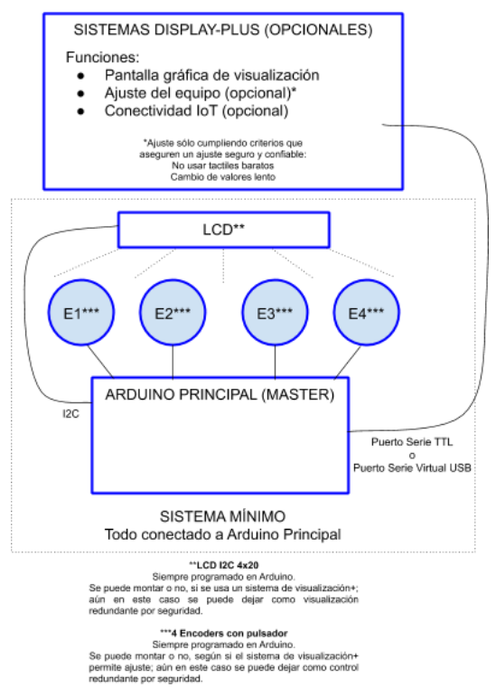

# Requisitos

Los requisitos del proyecto son un documento vivo que se encuentra -> [aquí](https://docs.google.com/document/d/1lItbWZhYFjCUJKEzwG3V0N3ZbFNCW4r7WvXlSnQcjlk/edit?usp=sharing)

Todo lo que viene aquí más adelante es un resumen un poco más ordenado, pero que puede estar desactualizado respecto al oficial.

## Proyecto

TODO:

El proyecto consiste en desarrollar realizar toda la parte software de adquisición y visualización de datos, así como configuración de un respirador automático Open Source desarrollado por la comunidad maker junto con la HUCA. Todo esto va sobre un pc comunicado con el respirador a través de una conexión USB (serial).

El respirador consiste en:

- Una MCU basada en un Arduino Mega.
- Comunicación con sensores a través de SPI.
- Conexión serie (USB) a través del Serial (Serial0) del Mega para poder mandar y recibir datos.
- Un display LCD conectado por I2C con el que se interacciona por ahora y que se puede dejar a modo de información redundante.

Este proyecto se enfoca en la conexión serial para que el personal sanitario pueda tener en una pantalla toda la información y poder modificar parámetros en el respirador.

## Conexión Serie

La conexión serie se hace siguendo los parámetros, 115200/8-N-1, es decir:

- Baud rate 115200
- Byte size 8
- Parity None
- Stopbits 1

El respirador manda datos de lectura de los sensores, y también se le pueden mandar datos poder cambiar la configuracion:

- [Leer datos del respirador](tx.md)
- [Mandar datos al respirador](rx.md)
